***

# Оглавление
- [Задание №1](#задание-№1)
  - [Клонирование репозитория](#клонирование-репозитория)
  - [Настройка jupyter notebook](#настройка-jupyter-notebook)
  - [Настройка jupyterhub server](#настройка-jupyterhub-server)
  - [Настройка PostgeSQL](#настройка-postgesql)
  - [Ответы на вопросы](#ответы-на-вопросы)
- [Задание №2](#задание-№2)
  - [1.Используемые инструменты для мониторинга, сбора метрик и визуализации.](#конфигурация-системы-мониторинга-на-базе-prometheus-grafana-loki)
  - [2. Добавление сервисов в Docker Compose](#2-добавление-сервисов-в-docker-compose)
  - [3. Дашборды](#3-дашборды)
  - [4. Алерты](#4-алерты)
    - [4.1 Алерт использования CPU на 80%](#41-алерт-использования-cpu-на-80)
    - [4.2 Алерт входа по SSH на сервер.](#42-алерт-входа-по-ssh-на-сервер)
  - [Итог](#итог)
2. Добавление сервисов в Docker Compose
***

# Задание №1
***
Необходимо:

1. Развернуть jupyterhub и Postgres.

2. Зарегестрировать 3 пользователей в jupyterhub.

3. Настроить соеденение Postgres с jupyterhub с помощью библиотеки psycopg2


Контрольные вопросы:   
1. На каком порту разворачивается юпитер?
2. Есть ли у пользователей пароли или их кто-то задает?
3. В случае добавления пользователя - как это сделать?
4. В случае увольнения пользователя - как его убрать?
5. В каком виде и где хранятся пароли пользователей?
6. Как смотреть активен ли пользователь? Например он уволился, но нам не сказали, а учетка жива
7. И как посмотреть активность пользователя - сколько его ноутбуки поджирают места
***


## Клонирование репозитория
Предварительно нужно установить  [ubuntu server, docker и docker-compose](./docs/install_docker.md)  

### Запуск приложений
```bash
cd ~
git clone https://github.com/vokulovskiy/firetech_41.git 
cd firetech_41
```
Переименовать файлы и заполнить своими данными:  
  .env.example -> .env   
  configs/alertmanager.example.yml -> configs/alertmanager.yml
```bash
## Запускаем приложения
docker compose up --build -d
```
## Настройка jupyter notebook

В качестве тетрадки для пользователя выбран минимальный базовый образ jupyter/minimal-notebook. Из него собирается кастомная тетрадка с предустановленными библиотеками: numpy, pandas, psycopg2-binary и т.п.

В репозитории https://hub.docker.com/u/jupyter хранится много готовых образов с предустановленными различными фреймворками для НС. При развертывании на реальный сервер нужно выбрать образ под требования DS
```bash
# Сборка образа для ноутбуков
cd configs
docker build -f Dockerfile.notebook -t pattern_notebook:v1 .
cd ..
```
***
## Настройка jupyterhub server

Был взят базовый образ jupyterhub и на его основе собирается кастомный образ т.к. настройки хранятся в файле [jupyterhub_config.py](./configs/jupyterhub_config.py) и при его изменении нужно пересобирать образ. В jupyterhub добавлены следующие библиотеки:

**1. ``oauthenticator``** - 
Библиотека для аутентификации пользователей через протокол OAuth2.
Позволяет пользователям авторизовываться через внешние провайдеры (например, GitHub, Google, Microsoft), что упрощает управление учётными записями.

**3. `dockerspawner`** - 
Расширение JupyterHub для запуска отдельных Docker-контейнеров для каждого пользователя.
Обеспечивает полную изоляцию рабочих сред пользователей, что особенно важно в многопользовательских системах.

**4. `jupyterhub-nativeauthenticator`** - 
Библиотека для локальной аутентификации на основе имени пользователя и пароля.
Полезна для случаев, когда требуется использовать локальные учётные записи без интеграции с внешними провайдерами.

**5. `prometheus-client`** - 
Библиотека для интеграции с системой мониторинга Prometheus.
Помогает администраторам собирать метрики производительности и состояния системы, что необходимо для оптимизации работы JupyterHub.
***

Аутентификация :
- `c.JupyterHub.authenticator_class` = `NativeAuthenticator`: Используется локальный аутентификатор `NativeAuthenticator`, который позволяет пользователям регистрироваться через форму с логином и паролем.

- `c.NativeAuthenticator.open_signup` = `False`: Запрещает новым пользователям самостоятельно регистрироваться на платформе.

- `c.JupyterHub.spawner_class` = `DockerSpawner`: Используется спонер DockerSpawner, который запускает отдельный Docker-контейнер для каждого пользователя.

***
## Настройка PostgeSQL
Взят официальный образ postgres:17   
Для первичного доступа в Postgres данные хранятся в файле [.env](./.env), в дальнейшем они так же используются для postgres-exporter.   
Для тестирования подключения к Postgres из тетрадки можно восбользоваться [блокнотом](docs/test_pg.ipynb)
***
## Ответы на вопросы
1. На каком порту разворачивается юпитер?   
  `В данной конфигурации JupyterHub разворачивается па 8000 порту.`
2. Есть ли у пользователей пароли или их кто-то задает?   
  `Пользователь сам задает пароль при регистрации на первом входе в JupyterHub http://your-domain:8000/hub/signup`   
  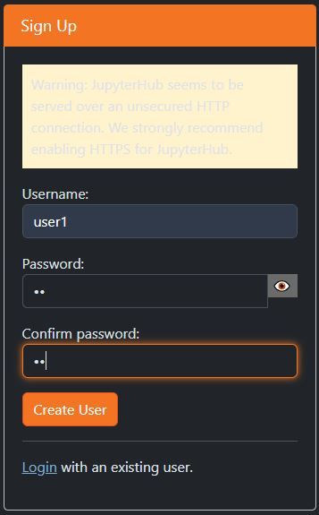   
  `В дальнейшем администратор может поменять пароль на странице http://your-domain:8000/hub/authorize`   
  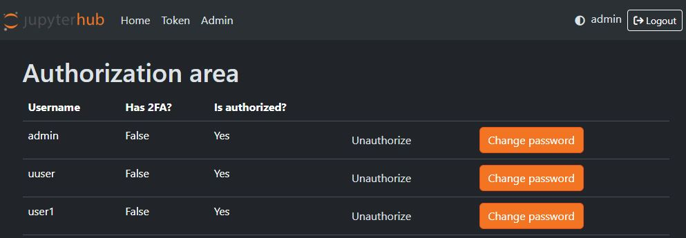
3. В случае добавления пользователя - как это сделать?
  `Администратор добавляет пользователей на странице http://your-domain:8000/hub/admin#/`
  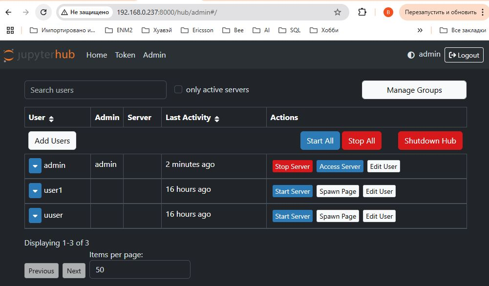
4. В случае увольнения пользователя - как его убрать?  
  `Администратор удаляет пользователей на странице http://your-domain:8000/hub/admin#/edit-user`
5. В каком виде и где хранятся пароли пользователей?   
  `Пароли хранятся в зашифрованном виде в /data/jupyterhub.sqlite`
6. Как смотреть активен ли пользователь? Например он уволился, но нам не сказали, а учетка жива.   
  `Администратор может посмотреть активность пользователей на странице http://your-domain:8000/hub/admin#/ колонка Last Activity`
7. И как посмотреть сколько его ноутбуки поджирают места  
  `Каждый ноут пользователя - это отдельный докер контейнер. Статистику по ним можно посмотреть в графане, или командой`  
  ```bash
  docker stats --no-stream
  ```
 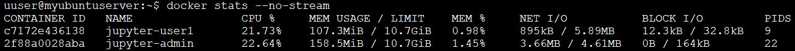 
8. [Как подключиться к тетрадке в JupyterHub через Visual Studio Code](docs/Connect_VSC.md) 

## Заключение
В ходе выполнения домашнего задания мы научились разворачивать jupytehub c возможностью регистрации новых пользователей, а так же подключаться через Jupyterhub к базе данных Postgres и манипулировать данными.


# Задание №2

***
## Техническое задание

### Настроить Мониторинг.

- Дашборд активности пользователей в юпитер (количество операций в день)

- Дашборд по топовым тетрадкам (сколько подъедают)

- Дашборд топовых таблиц в постресе с их владельцами

### Настроить алерты.

- Настроить алерт при заходе пользователя на сервер по ssh на почту.

- Настроить почтовый алерт при потребление общим количеством контейнеров мощности более чем на 80 % - алертить.

***
## Конфигурация системы мониторинга на базе Prometheus, Grafana, Loki.

**Для сбора метрик** и их экспорта, а так же визуализации будем использовать следующие образы:

`Prometheus` - Основной инструмент для сбора и хранения метрик от различных источников.

`Grafana` - Платформа для визуализации данных и создания дашбордов. Поддерживает множество источников данных, включая Prometheus.

`Loki` - Основной инструмент для сбора и хранения логов от различных источников. Кроме всего прочего будет использоваться для алерта, при заходе пользователя на сервер по ssh.

`postgres-exporter` - Exporter для сбора метрик PostgreSQL. Преобразует статистику PostgreSQL в формат, понятный Prometheus. В том числе доступен сбор метрик по кастомному SQL запросу.

`cadvisor` - Exporter потребления ресурсов (CPU, память, диск, сеть) для всех контейнеров на хост-машине.

`Node Exporter` — это экспортер Prometheus для сбора данных о состоянии сервера с подключаемыми коллекторами метрик. Он позволяет измерять различные ресурсы машины, такие как использование памяти, диска и процессора.

`Promtail`  - это агент, который собирает журналы, превращает их в потоки, добавляя метки, а после отправляет всё в Loki с помощью HTTP API.

**Для алертов**

`alertmanager` - Система управления оповещениями для Prometheus. Обрабатывает алерты, отправляемые Prometheus, и доставляет их через различные каналы (email, telegram и др.).

***
## 2. Добавление сервисов в Docker Compose

1. Для создания полнофункциональной системы мониторинга допишем все необходимые образы в **[Docker-compose](docker-compose.yml)** 

2. Для корректной работы `Prometheus` необходимо определить все `scrape jobs` в файле **[prometheus.yml](configs/prometheus.yml)**. Этот файл определяет, какие сервисы и эндпоинты Prometheus должен мониторить для сбора метрик. 

3. Для работы с образом **`postgres-exporter`** требуется настроить файл **[queries.yaml](configs/queries.yaml)**. Этот файл содержит конфигурацию пользовательских метрик и SQL-запросы, которые будут выполняться для сбора данных из базы данных PostgreSQL. 


4. Для `alertmanager` необходимо настроить файлы **[alertmanager.yml](configs/alertmanager.yml)** и **[alert.rules.yml](configs/alert.rules.yml)**

- `alertmanager.yml` : Отвечает за управление и доставку алертов (кому и как отправлять уведомления).

- `alert.rules.yml` : Определяет условия для генерации алертов (когда и почему срабатывает алерт).


Соберем наш образ командой  `Docker-compose up -d`  
И убедимся, что все работает. `docker ps`


Проверьте работу: 

- `Prometheus` по адресу `http://localhost:9090`

- `Grafana` по адресу `http://localhost:3000`

Чтобы войти в `Grafana` по умолчанию используется ЛОГИН `admin` ПАРОЛЬ `admin` после система предложит вам изменить пароль (если при сборке образа вы не задали другие учетные данные)
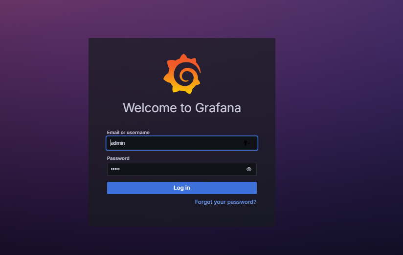


Проверим работу всех exporter в `prometheus`.

`http://localhost:9090/targets`

Убедимся, что `State` у всех `exporter` имеет статус UP (значит все `exporter` передают наши метрики в `prometheus`)

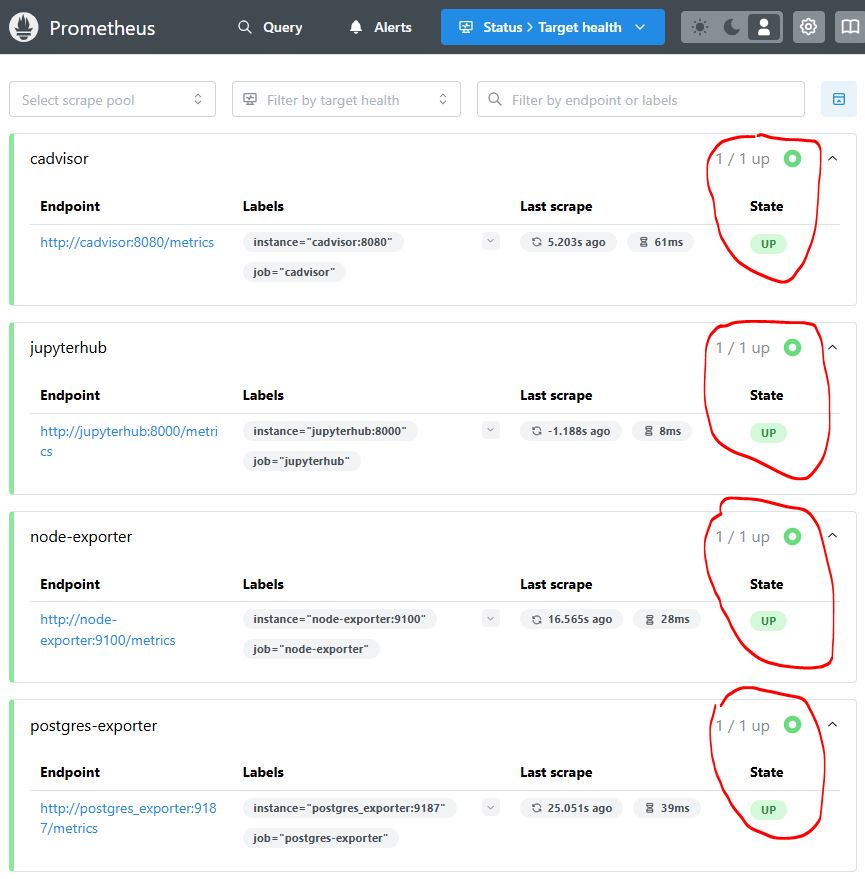

Переходим в `http://localhost:9090/alerts` и проверяем добавился ли наш алерт 
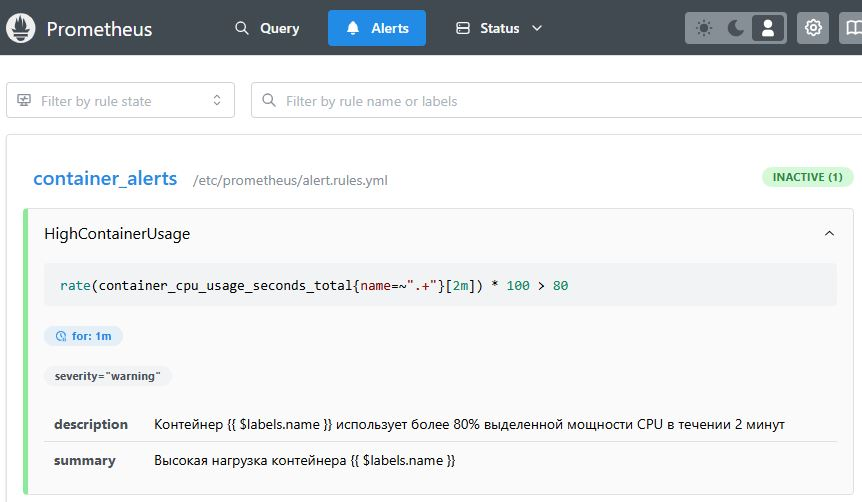   


***
## 3. Дашборды

Добавим источник данных в `Grafana` заходим в раздел `Data sources` и добавляем  `prometheus` и `loki` в графе `Connection` прописываем `host` и `port`

Наши контейнеры находятся в общей сети `monitoring` поэтому обращаемся по названию конрейнера и порту(если контейнеры находятся в разных сетях обращаться необходимо по IP либо localhost и внешнему порту который вы прокинули наружу).

1. Выберем раздел `dashboards`
2. Готовые дашборды можно поискать на сервере https://grafana.com/grafana/dashboards/   
  для PostgreSQL: 455, 9628   
  для Node Exporter: 1860, 15172, 10242   
  для Docker(cadvisor): 10619, 893, 13946
***

**Создадим  дашборд по нашему заданию:**   
Метрики:
- `jupyterhub_total_users` - количество зарегистрированых пользователей
- `jupyterhub_active_users{period="24h"}` - количество активных пользователей за 24 часа
- `jupyterhub_running_servers` - количество запушенных серверов
- `sum(jupyterhub_request_duration_seconds_count)` - количество запросов
- `container_memory_usage_bytes{image="pattern_notebook:v1"}` - Использование памяти тетрадками пользователей
- `container_fs_usage_bytes{image="pattern_notebook:v1"}` - Объем используемого дискового пространства тетрадками пользователей
- `tables_info_table_size` - Размеры таблиц пользователей в PostgreSQL(была определена внутри **[queries.yaml](configs/queries.yaml)**) 
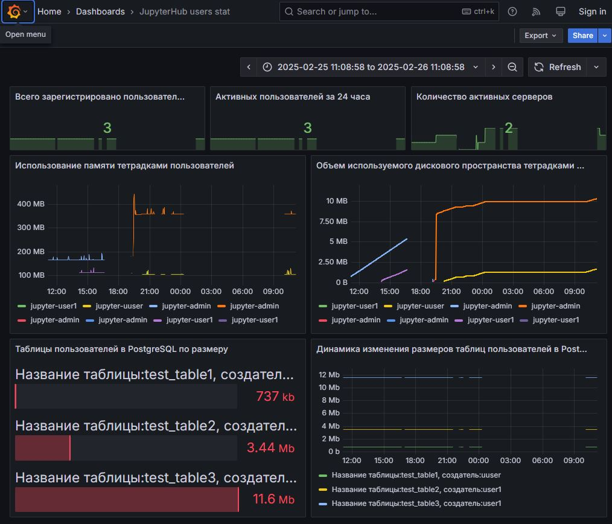

http://krg-utyak.tplinkdns.com:3000/public-dashboards/d9a3a8b0dc5945a7ba9573b347d3d929
***
## 4. Алерты

### 4.1 Алерт использования CPU на 80%
Настраивается в prometheus [alert.rules](configs/alert.rules.yml)   
Проверим приходят ли оповещения. В ноутбуке даем команду `!while true; do echo “HOT HOT HOT CPU”; done`   
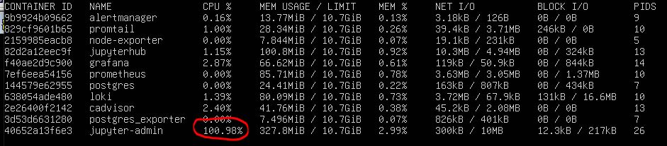
Проверяем почту:   
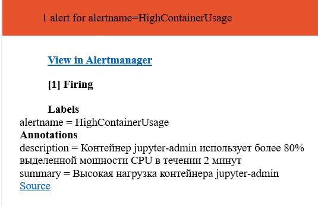

***
### 4.2 Алерт входа по SSH на сервер.

1. Создаем "Contact point" в Grafana, необходимо подключить alertmanager в качестве контакта.
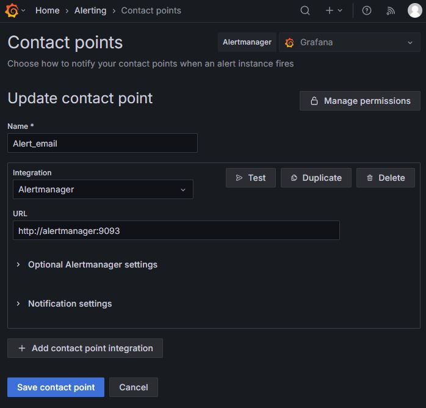
Нажимаем "Test", проверяем, что письмо пришло.
***
2. Создаем "Alert rule":
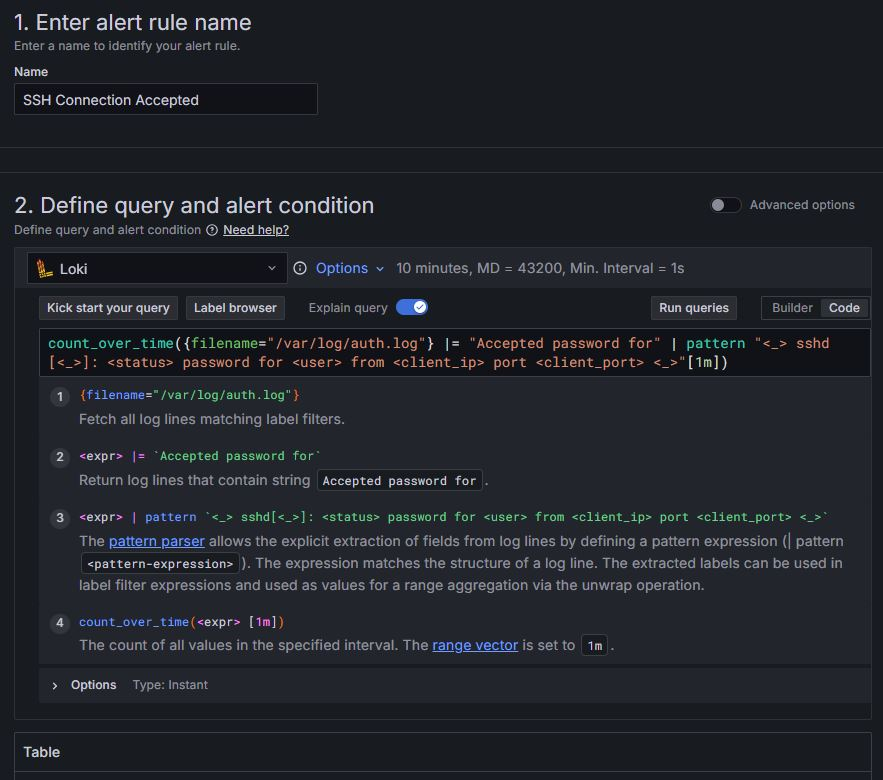
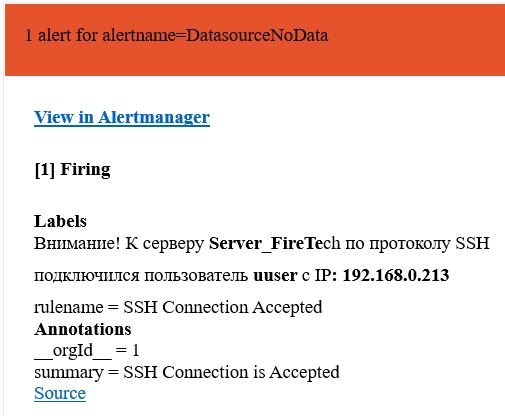

# Итог

В рамках выполнения второго домашнего задания мы приобрели практические навыки в настройке комплексной системы мониторинга и логирования, основанной на следующих ключевых компонентах:

`Prometheus` : Изучили основы конфигурации `Prometheus` для сбора и хранения метрик различных сервисов. Настроили `scrape jobs` для сбора данных с разных источников. Создали аларм на почту при использования CPU в контейнере > 80%.

`Loki` : научились собирать системные логи и логи Docker.

`Grafana` : Научились создавать дашборды для визуализации собранных метрик, что позволяет эффективно анализировать состояние системы и выявлять тренды. Создали аларм на почту, используя системные логи.

В результате работы мы создали полноценную инфраструктуру мониторинга, способную обеспечивать прозрачность производительности системы, оперативное обнаружение проблем и автоматическое информирование ответственных лиц о чрезвычайных ситуациях.
