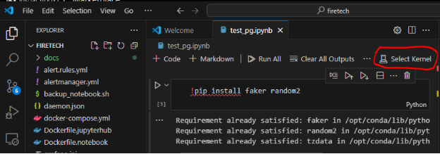

**Чтобы подключиться к тетрадке в JupyterHub из Visual Studio Code, нужно**:

1. **Получить JupyterHub access token**. Авторизуйтесь в JupyterHub, введя свой логин и пароль. Перейдите в Hub Control Panel (File -> Hub Control Panel). Затем перейдите на вкладку Token, выбрав этот пункт в верхней части меню. Введите описание нового токена, выберите срок действия токена и нажмите «Request new API token». Скопируйте сгенерированный токен и сохраните его в безопасном месте.  
1. **Подключить VS Code к удаленному JupyterHub серверу**. 

   Установите в [VS Code](https://code.visualstudio.com/ "https://code.visualstudio.com/")  [JupyterHub Extension](https://marketplace.visualstudio.com/items?itemName=ms-toolsai.jupyter-hub "https://marketplace.visualstudio.com/items?itemName=ms-toolsai.jupyter-hub"). Откройте или создайте файл .ipynb, (Ctrl+Shift+P) и выберите «Jupyter: Create New Jupyter Notebook». В меню выбора ядра выберите «Existing JupyterHub Server...» 
   

   Введите адрес вашей тетрадки в виде:

   http://<адрес сервера>:8000/?token=<токен из 1 пункта>

   Введите ваш логин и пароль JupyterHub.

1. **Проверить созданное подключение**. 

   Выполните команду !hostname, которая должна вернуть имя хоста удалённого сервера JupyterHub вместо локального имени хоста.  

